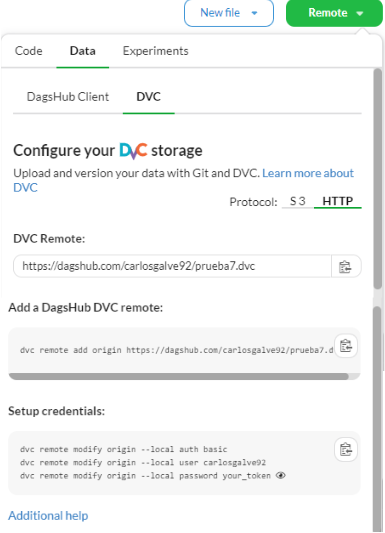

# DagsHub

**DagsHub** es una plataforma colaborativa para *Data Science* y *Machine Learning*, similar a GitHub pero diseñada específicamente para el versionado de datos, modelos y experimentos. Está construida sobre herramientas como **DVC** (*Data Version Control*) y **MLflow**, lo que la convierte en una opción idónea para flujos de trabajo de **MLOps**.

> **Requisito previo:** los pasos de este documento asumen que ya existe un repositorio DVC inicializado en local (véase la guía de DVC).

---

## 1. Configuración del repositorio remoto para almacenar archivos

Una vez inicializado el repositorio DVC, es necesario configurar un remoto que apunte a DagsHub. El proceso consta de dos fases: registrar el remoto y configurar las credenciales de autenticación.

### Añadir el repositorio remoto

```bash
dvc remote add origin https://dagshub.com/<usuario_dagshub>/<repositorio_dagshub>.dvc
```

En este ejemplo se ha asignado el nombre `origin` para identificar el remoto en local.

### Configurar las credenciales de autenticación

```bash
dvc remote modify origin --local auth basic
dvc remote modify origin --local user <usuario_dagshub>
dvc remote modify origin --local password <token>
```

> **Nota de seguridad:** el uso del modificador `--local` garantiza que las credenciales se almacenen en `.dvc/config.local`, fichero excluido de Git. Nunca deben subirse tokens ni contraseñas al repositorio.

El *token* de acceso puede obtenerse desde la interfaz de DagsHub, dentro del propio repositorio, mediante el botón de copiar tal como se muestra en la siguiente imagen:



---

## 2. Configuración de MLflow para el seguimiento de experimentos

Además del versionado de datos con DVC, cada repositorio de DagsHub incluye un **servidor de MLflow alojado**, sin necesidad de infraestructura propia. Para registrar experimentos basta con apuntar el cliente de MLflow a la URI de seguimiento del repositorio y autenticarse con las mismas credenciales de DagsHub.

> **Nota:** solo los **colaboradores** del repositorio (usuarios con permiso de escritura, es decir, que pueden hacer `git push`) pueden registrar experimentos.

### URI de seguimiento

Cada repositorio expone su propia URI de MLflow, que sigue este patrón:

```
https://dagshub.com/<usuario_dagshub>/<repositorio_dagshub>.mlflow
```

Es la misma URL del remoto DVC visto en la sección 1, pero terminada en `.mlflow` en lugar de `.dvc`.

### Configuración manual

Se define la URI de seguimiento en el código y las credenciales mediante variables de entorno. El cliente de MLflow usa autenticación básica a través de `MLFLOW_TRACKING_USERNAME` y `MLFLOW_TRACKING_PASSWORD`:

```python
import os
import mlflow

# Apuntar al servidor MLflow del repositorio
mlflow.set_tracking_uri("https://dagshub.com/<usuario_dagshub>/<repositorio_dagshub>.mlflow")

# Credenciales (el password es preferiblemente un token de acceso)
os.environ["MLFLOW_TRACKING_USERNAME"] = "<usuario_dagshub>"
os.environ["MLFLOW_TRACKING_PASSWORD"] = "<token>"
```

Como alternativa, las variables de entorno pueden exportarse en la terminal antes de ejecutar el script, en lugar de fijarlas dentro del código:

```bash
export MLFLOW_TRACKING_URI=https://dagshub.com/<usuario_dagshub>/<repositorio_dagshub>.mlflow
export MLFLOW_TRACKING_USERNAME=<usuario_dagshub>
export MLFLOW_TRACKING_PASSWORD=<token>
```

> **Nota de seguridad:** al igual que con DVC, el *token* nunca debe subirse a Git. Conviene proporcionarlo mediante variables de entorno o un fichero de secretos excluido del control de versiones, no escribirlo directamente en el código versionado. El token se obtiene en <https://dagshub.com/user/settings/tokens>.

---

## 3. Apéndice: acceso a DagsHub con credenciales de GitHub

Si se dispone de una cuenta de GitHub, el acceso a DagsHub es inmediato:

1. Acceder a la [plataforma de DagsHub](https://dagshub.com).
2. Pulsar **Log in** en la parte superior de la página.
3. Seleccionar **Continue with GitHub** e introducir las credenciales de GitHub.

---

## 4. Apéndice: crear un repositorio conectado a uno existente en GitHub

Una vez dentro de DagsHub con las credenciales de GitHub, se puede vincular un repositorio existente siguiendo estos pasos:

1. Seleccionar la opción de **crear un nuevo repositorio**.
2. De las tres opciones disponibles, elegir **Connect a repository**.
3. Seleccionar **GitHub** como origen.
4. Conceder a DagsHub los permisos sobre el repositorio que se desea vincular y guardar.
5. Seleccionar el repositorio autorizado para completar la conexión.
